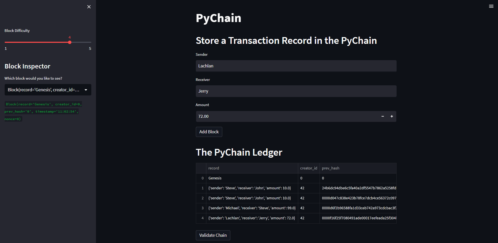
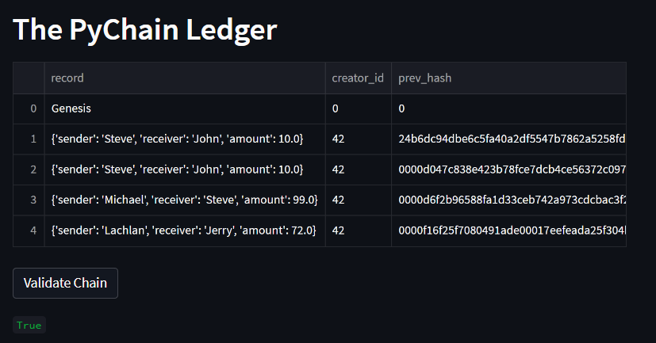

# Creating_A_Mini_Blockchain

In this challenge, we were tasked to create a Genesis block on the ledger and then be able to create and add new blocks to form a chain of data. This was double checked through validation and receiving a true or false statement.

---

## Technologies

Creating a Mini Blockchain and utilizes the following project libraries and dependencies:
* [Streamlit](https://streamlit.io/) - a Python library that turns Python scripts into shareable web apps
* [Pandas](https://pandas.pydata.org/) - a software library designed for open source data analysis and manipulation
* dataclasses
* typing
* hashlib


---

## Installation Guide


Download Anaconda for your operating system and the latest Python version, run the installer, and follow the steps. Restart the terminal after completing the installation. Detailed instructions on how to install Anaconda can be found in the [Anaconda documentation](https://docs.anaconda.com/anaconda/install/).

This challenge utilizes Streamlit to create a user-friendly webpage interface for a blockchain. To import Streamlit, run the following command:

```python
pip install streamlit
```

---  

### **Run instructions:**
To run this analysis, simply clone the repository or download the files. Open a terminal instance and navigate to the directory that contains the **pychain.py** file, and then run the following command:
```python
streamlit run pychain.py
```
___
## Streamlit User Interface

Utilizing the Streamlit interface, the user is able to enter sender, receiver, and amount details and click on 'Add Block' to create a new block. A block inspector is available on the left-hand side to verify the block has been added or to review all blocks stored in the ledger. 



Below is an image displaying all of the information from the table as it was cut off with a scrollbar.


The user is then allowed to press the validation button which performs a check to make sure that the blocks have been added correctly and are validated.




---

## Contributors

This project was created as part of the module 18 challenge in the Monash University Fintech Bootcamp 2022 Program by:

Lachlan Andrews

Email: swerdna14@gmail.com

LinkedIn: lachlanjandrews
